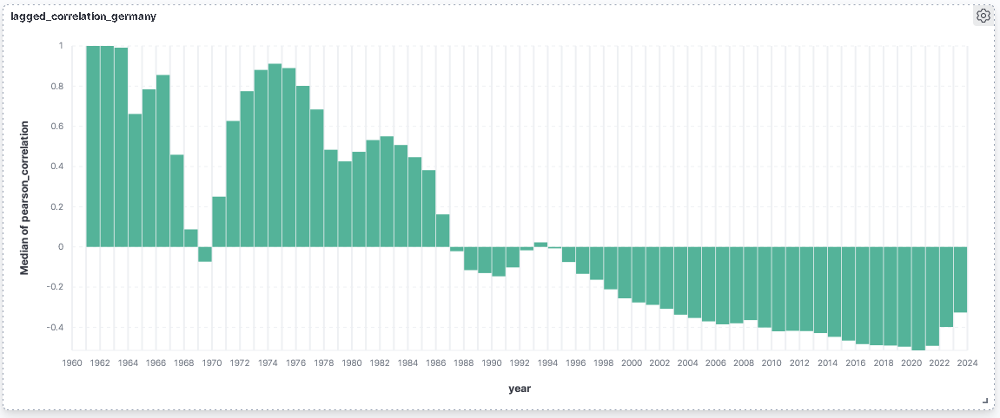

GDP-INFLATION-PIPELINE

Ein datenintensives ETL-Projekt zur Analyse globaler BIP- und Inflationsdaten mit Daten aus Kaggle und mithilfe von Apache Spark, Docker und dem ELK-Stack.


Technologien:

- Apache Spark (Datenverarbeitung)
- Docker & Docker-Compose (Containerisierung)
- MySQL (Datenbank)
- Logstash, Elasticsearch, Kibana (Monitoring mit ELK)
- Python (Dateninjektion, Analyse)


Projektstruktur:

```plaintext
├── data/                  # Roh- und verarbeitete CSV-Daten
├── ingestion/             # Injektion der CSV-Dateien in das System
├── spark/                 # Spark-Logik und Verarbeitungsskripte
├── mysql/                 # SQL-Initialisierungsskript
├── elk/                   # Konfiguration für ELK-Stack (Logging)
├── logs/                  # Log-Dateien (z. B. von Spark)
├── docker-compose.yml     # Docker-Setup
├── .gitignore             # Ausgeschlossene Dateien
└── README.md              # Projektbeschreibung (du liest sie gerade)


Ablauf der Pipeline:

- CSV-Dateien werden manuell oder automatisch (z. B. vierteljährlich) im raw/-Ordner abgelegt
- Ein Docker-Ingestion-Container liest sie ein und legt sie temporär ab
- Spark verarbeitet und aggregiert die Daten
- Ergebnisse werden in MySQL gespeichert
- System-Logs und Statusdaten sind über Kibana einsehbar


Schnellstart: (lokal)

# Docker-Container starten
docker-compose up --build

# Einzelne Container neu starten oder debuggen
docker-compose restart spark
docker-compose logs ingestion

Kibana im Browser unter http://localhost:5601


Beispiel: Analyse

- Korrelation von BIP und Inflation
- Regionale Unterschiede
- Zeitliche Entwicklung


Datenquelle:

Die verwendeten Rohdaten stammen von Kaggle:
o	Kaggel, Global GDP-PIB per Capita 
	https://www.kaggle.com/datasets/fredericksalazar/global-gdp-pib-per-capita-dataset-1960-present/data
o	Kaggle: Global Inflation rate (1960-present)
	https://www.kaggle.com/datasets/fredericksalazar/global-inflation-rate-1960-present


Analyse: Korrelation zwischen Inflation und GDP-Wachstum

### Deutschland: Lagged Pearson-Korrelation (1960–2023)

Die folgende Visualisierung zeigt die zeitversetzte Korrelation (lagged Pearson correlation) zwischen Inflation und dem Wirtschaftswachstum in Deutschland.

- Ein positiver Wert bedeutet, dass steigende Inflation mit steigendem BIP-Wachstum im Folgejahr korreliert.
- Ein negativer Wert deutet auf einen entgegengesetzten Zusammenhang hin.




Autor:

Kirsten Zoellner
Studierender der IU | Wirtschaftsinformatik mit Schwerpunkt Data Engineering  
[GitHub-Profil](https://github.com/KirstenZoellner)

