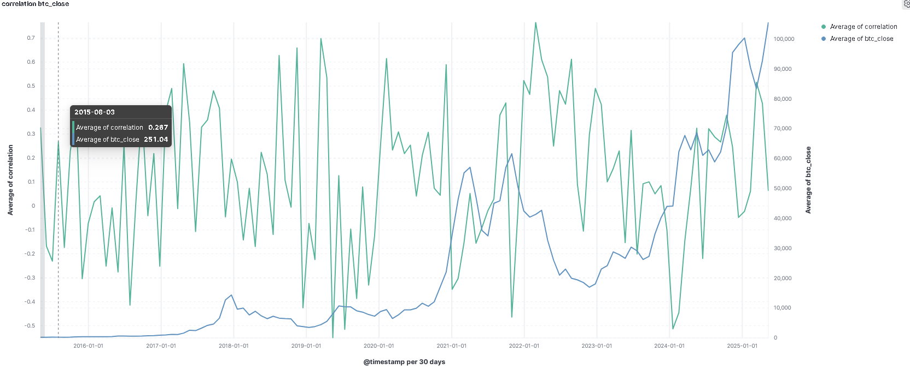
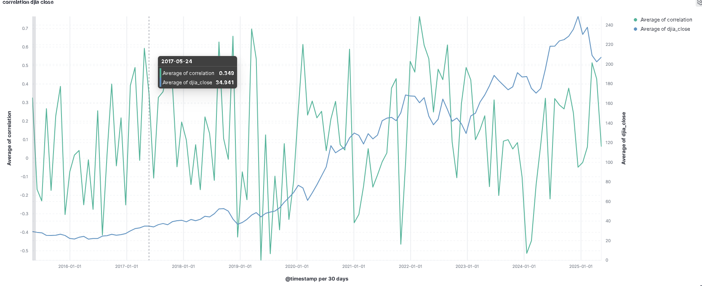

# Data-Pipeline: Korrelation zwischen Bitcoin und Börsen

# Projektbeschreibung

Dieses Projekt analysiert die Korrelation zwischen der Kryptowährung Bitcoin und traditionellen Börsenindizes wie dem Dow Jones Industrial Average (DJIA). Die Daten stammen von der Plattform [Kaggle](https://www.kaggle.com/) und enthalten über 1 Million Datenpunkte, die täglich bzw. minütlich aktualisiert werden.

Ziel ist es, mithilfe moderner Big-Data-Technologien aussagekräftige Analysen über mögliche Zusammenhänge zwischen traditionellen und digitalen Finanzmärkten durchzuführen.

# Projektstruktur

```text
data-pipeline/
├── data/
│   ├── raw/
│   │   ├── bitcoin/
│   │   │   └── btcusd_1-min_data.csv
│   │   └── djia/
│   │       ├── dow_jones_data.csv
│   │       └── djia_clean.csv
│   └── processed/
│       └── combined_daily_and_summary.csv
├── images/
│   ├── correlation_btc_close.png
│   └── correlation_djia_close.png
├── ingestion/
│   └── kaggle/
│       ├── kaggle.json
│       └── Dockerfile
├── spark/
│   ├── process.py
│   └── Dockerfile
├── mysql/
│   └── init.sql
├── elk/
│   └── logstash.conf
├── docker-compose.yml
├── run_pipeline.bat
├── README.md
└── .gitignore
```


# Technologien

* Docker & Docker-Compose:                      Containerisierung und Orchestrierung der Microservices
* Apache Spark:                                 Verarbeitung, Aggregation und Analyse großer Datenmengen
* MySQL:                                        Persistente Speicherung der bereinigten und aggregierten Daten
* ELK Stack (Elasticsearch, Logstash, Kibana):  Visualisierung und Überwachung von Logs und Status
* Kaggle API:                                   Download der Rohdaten
* GitHub:                                       Versionierung und Codeverwaltung

# Datenpipeline-Ablauf

1. **Datenbeschaffung**:

   * Die historischen Daten zu Bitcoin und DJIA werden automatisch per Kaggle-API heruntergeladen.
2. **Ingestion Service**:

   * Die CSV-Dateien werden in ein temporäres Verzeichnis geschrieben.
3. **Verarbeitung mit Spark**:

   * Start über Docker Compose
   * Bereinigung, Aggregation und Korrelation der Daten
   * Speicherung in MySQL
4. **Überwachung**:

   * ELK-Stack visualisiert Logs und den Zustand des Systems in Echtzeit.

# Architekturprinzipien

* Microservice-Architektur zur Trennung von Zuständigkeiten
* Skalierbarkeit durch Spark & Docker
* Sicherheit durch eingeschränkte Netzwerkbereiche und Zugang zu Services
* Einhaltung von Datenschutz und Data-Governance-Prinzipien

# Datenquellen

* [Bitcoin Historical Data – minütlich](https://www.kaggle.com/datasets/mczielinski/bitcoin-historical-data)
* [DJIA Historical Data – täglich](https://www.kaggle.com/datasets/joebeachcapital/djia-stocks-historical-ohlcv-daily-updated)

# Visualisierungen

# Bitcoin Close Price Correlation



# DJIA Close Price Correlation


